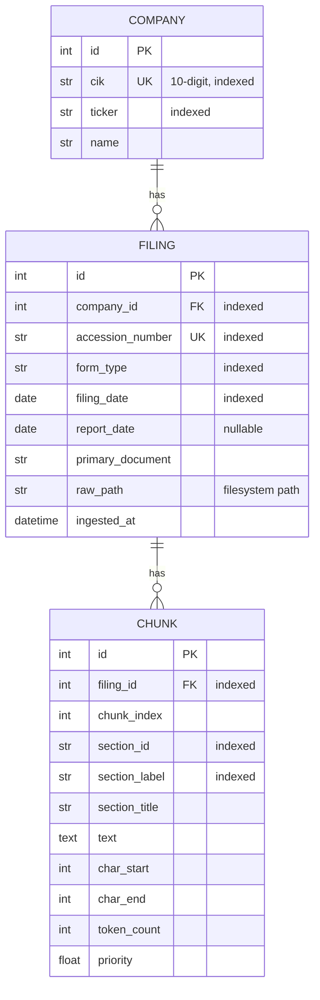

# Data Model

**Status:** :material-check: Implemented · **Package:** `db/`

The metadata catalog is the source of truth for what has been ingested. It is a SQLite
database accessed through **SQLAlchemy 2.0 async** (`aiosqlite` driver). The default URL
is `sqlite+aiosqlite:///./data/finlab.db` (see [Configuration](configuration.md)).

## Entity relationships



Relationships are bidirectional with `cascade="all, delete-orphan"`: deleting a company
removes its filings; deleting a filing removes its chunks. `Filing` also carries a
composite `UniqueConstraint(company_id, accession_number)` in addition to the unique
`accession_number` (globally unique across EDGAR).

## Tables — `db/models.py`

=== "companies"

    | Column | Type | Notes |
    |--------|------|-------|
    | `id` | int | PK |
    | `cik` | str(10) | unique, indexed |
    | `ticker` | str(10) | indexed |
    | `name` | str(255) | |

=== "filings"

    | Column | Type | Notes |
    |--------|------|-------|
    | `id` | int | PK |
    | `company_id` | int | FK → companies.id, indexed |
    | `accession_number` | str(25) | unique, indexed |
    | `form_type` | str(20) | indexed |
    | `filing_date` | date | indexed |
    | `report_date` | date? | nullable |
    | `primary_document` | str(255) | |
    | `raw_path` | str(500) | provenance: on-disk location |
    | `ingested_at` | datetime | set at insert |

=== "chunks"

    | Column | Type | Notes |
    |--------|------|-------|
    | `id` | int | PK |
    | `filing_id` | int | FK → filings.id, indexed |
    | `chunk_index` | int | 0-based within filing |
    | `section_id` | str(50) | indexed — e.g. `item_1a` |
    | `section_label` | str(50) | indexed — e.g. `risk_factors` |
    | `section_title` | str(500) | |
    | `text` | text | title-prefixed content |
    | `char_start` / `char_end` | int | source span for citation |
    | `token_count` | int | approx (`len//4`) |
    | `priority` | float | retrieval boost |

The indexes on `filing_date`, `form_type`, `section_id`, and `section_label` are chosen
for the queries the system needs: temporal range scans, form filtering, and
retrieval-time section pre-filtering.

## Session & lifecycle — `db/session.py`

```python
engine = create_async_engine(settings.database_url, echo=False, future=True)
SessionLocal = async_sessionmaker(engine, class_=AsyncSession, expire_on_commit=False)

@asynccontextmanager
async def get_session():
    async with SessionLocal() as session:
        try:
            yield session
            await session.commit()      # commit on success
        except Exception:
            await session.rollback()    # roll back on error
            raise

async def init_db():
    # create_all — dev convenience; production is expected to use Alembic
    async with engine.begin() as conn:
        await conn.run_sync(Base.metadata.create_all)
```

`get_session()` gives every unit of work commit-on-success / rollback-on-error semantics.
`init_db()` creates tables directly for development; **Alembic is a declared dependency but
no migrations exist yet** — schema evolution is still `create_all`.

## Repository operations — `db/repository.py`

| Function | Behavior |
|----------|----------|
| `upsert_company(session, dto)` | Select by `cik`; insert if absent, `flush` to populate `id`. |
| `upsert_filing(session, company, dto, raw_path)` | Select by `accession_number`; insert if absent, stamping `ingested_at`. |
| `persist_chunks(session, filing, chunks)` | **Delete** all existing chunks for the filing, then bulk-insert the new set. |

`persist_chunks` is deliberately delete-then-insert so re-chunking a filing replaces its
chunks cleanly rather than accumulating duplicates — the chunk-layer counterpart to the
raw layer's idempotency marker.

## Temporal fields — captured, not yet exploited

`filing_date` (indexed), `report_date`, and `ingested_at` are recorded on every filing.
Today they are only used for display/ordering (e.g. `smoke_test_db.py` orders by
`filing_date desc`). There is **no** point-in-time / "as-of" query logic, no amendment
(`10-K/A`) linkage, and no supersession handling yet. The schema is shaped to support those
later; building them is on the [Roadmap](roadmap.md). There is also **no embeddings
table** — vectors are expected to live in Chroma once that layer is wired.
