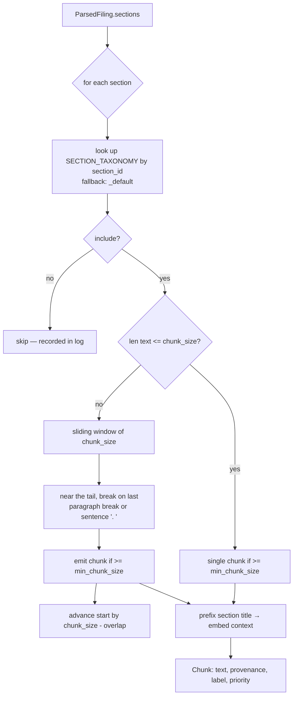

# Chunking

**Status:** :material-check: Implemented · **File:** `chunking/chunker.py`

`SectionAwareChunker.chunk_filing()` turns a `ParsedFiling` into a list of `Chunk`s. Unlike
a naive fixed-size splitter, it is **section-aware**: a whitelist decides *which* sections
are worth indexing, and each section gets a chunk size and retrieval priority chosen for
its role in investment research.

## Flow



## Section taxonomy

`SECTION_TAXONOMY` maps a normalized `section_id` to `{include, priority, chunk_size,
label}`. Priority is a retrieval boost (1.0 = baseline); dense, decision-relevant sections
get **smaller** chunks for precision and a **higher** priority.

| section_id | label | include | priority | chunk_size |
|-----------|-------|:------:|:-------:|:---------:|
| `item_1a` | risk_factors | ✅ | 1.5 | 800 |
| `item_7` | mdna | ✅ | 1.5 | 800 |
| `item_7a` | market_risk | ✅ | 1.3 | 800 |
| `item_1` | business | ✅ | 1.2 | 1000 |
| `item_8` | financials | ✅ | 1.0 | 1200 |
| `item_15` | financials | ✅ | 1.0 | 1200 |
| `item_9a` | controls | ✅ | 1.0 | 1000 |
| `item_5` | market_for_equity | ✅ | 0.9 | 1000 |
| `item_10` | governance | ✅ | 0.8 | 1000 |
| `item_11` | compensation | ✅ | 0.8 | 1000 |
| `item_13` | related_party | ✅ | 0.8 | 1000 |
| `item_2` | properties | ❌ | — | — |
| `item_3` | legal_proceedings | ❌ | — | — |
| `item_4` | mine_safety | ❌ | — | — |
| `item_9` | changes_in_accountants | ❌ | — | — |
| `item_9c` | foreign_jurisdictions | ❌ | — | — |
| `_default` | other | ✅ | 1.0 | 1000 |

Skipped sections are low-signal for equity research (Properties, Mine Safety) or usually
duplicated elsewhere (Legal Proceedings typically restated under Risk Factors). Unknown /
future `section_id`s fall through to `_default` and are still indexed.

## Chunking algorithm

`SectionAwareChunker(default_overlap=200, min_chunk_size=200)`:

- **Short sections** (`len(text) <= chunk_size`) become a single chunk, provided they meet
  `min_chunk_size`.
- **Long sections** use a sliding window of `chunk_size` characters. Near the tail of each
  window (last 200 chars) it looks for a paragraph break (`\n\n`) or sentence boundary
  (`. `) and cuts there, so chunks end on clean boundaries. The window then advances by
  `chunk_size - overlap`, giving a **200-char overlap** between neighbors to preserve
  context across cuts.

!!! warning "Sizes are in characters, and tokens are approximated"
    `chunk_size`, `overlap`, and `min_chunk_size` are **character** counts.
    `token_count` is computed as `len(text) // 4` — a rough proxy, **not** a real
    tokenizer. Downstream batching ([Embedding](embedding.md)) relies on this
    approximation; replacing it with the provider's tokenizer is on the
    [Roadmap](../roadmap.md).

## Contextual prefixing

Every chunk's text is prefixed with its section title before storage/embedding:

```python
text_with_context = f"[{section.title}]\n\n{text}"
```

This is a lightweight form of contextual retrieval: each chunk's embedding reflects both
its content **and** its section role, so a query about "risks" retrieves Risk-Factor
chunks even when a given slice never uses the word "risk." Cost is ~25–40 characters per
chunk. Note `char_start`/`char_end` still refer to offsets in the **original** section
text, so citations remain exact despite the prefix.

## The `Chunk` model

```python
class Chunk(BaseModel):
    # identity
    chunk_index: int
    accession_number: str
    ticker: str
    # section metadata — drives filtering + citation
    section_id: str        # "item_1a"
    section_label: str     # "risk_factors"
    section_title: str     # "Item 1A. Risk Factors"
    # content + provenance
    text: str              # title-prefixed content
    char_start: int
    char_end: int
    token_count: int       # len(text) // 4
    # retrieval hint
    priority: float
```

These fields map directly onto the `chunks` table (see [Data Model](../data-model.md)).
`section_label` and `priority` exist to support two things retrieval will need:
pre-filtering ("only `risk_factors` chunks") and priority-weighted ranking.
