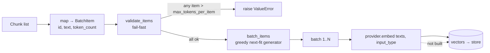

# Embedding

**Status:** :material-progress-helper: Partial · **Package:** `embedding/`

The embedding layer converts chunks into vectors. What exists today is the **typed
contract and the batching logic** plus a deterministic fake provider for testing. The real
Voyage provider, the orchestrating `Embedder`, and the write-to-vector-store step are not
yet implemented.

| Piece | File | Status |
|-------|------|--------|
| `BatchLimits`, `BatchItem`, `EmbeddingProvider` protocol | `contracts.py` | :material-check: Implemented |
| `validate_items`, `batch_items` | `batcher.py` | :material-check: Implemented |
| `FakeProvider` | `providers.py` | :material-check: Implemented (test double) |
| Voyage provider | `providers.py` | :material-close: Not implemented |
| `Embedder` orchestrator | `embedder.py` | :material-close: 2-line stub |
| Vector-store write (Chroma) | — | :material-close: Not wired |

## Batching flow



## Typed contracts — `contracts.py`

```python
@dataclass(frozen=True)
class BatchLimits:
    max_items: int = 128            # provider per-request item cap
    max_tokens_per_batch: int = 120000
    max_tokens_per_item: int = 2000
    # __post_init__ enforces: all > 0, and max_tokens_per_item <= max_tokens_per_batch

@dataclass(frozen=True)
class BatchItem:
    id: str          # stable identifier (e.g. accession#chunk_index)
    text: str
    token_count: int # pre-computed by the caller

class EmbeddingProvider(Protocol):
    async def embed(
        self,
        texts: list[str],
        input_type: Literal["document", "query"],
    ) -> list[list[float]]: ...
```

Design points:

- **`Protocol`, not a base class.** Any object with a matching async `embed` satisfies the
  interface — no inheritance required, and test doubles are trivial.
- **`document` vs `query` input types.** Asymmetric embedding: documents and queries can be
  encoded differently, which finance embedding models (e.g. `voyage-finance-2`) support.
- **Frozen dataclasses.** `BatchLimits` and `BatchItem` are immutable and validated at
  construction — invalid limits fail loudly at startup.

## Batching algorithm — `batcher.py`

Two functions, split so validation is separated from iteration:

```python
def validate_items(items, limits) -> None:
    # Fail-fast: raise on the FIRST item whose token_count exceeds
    # limits.max_tokens_per_item. Run this before batching so that,
    # if it returns, every produced batch is guaranteed valid.

def batch_items(items, limits) -> Iterator[list[BatchItem]]:
    # Greedy next-fit bin packing, as a generator.
    # Starts a new batch when adding the next item would exceed EITHER
    # max_tokens_per_batch OR max_items. Order is preserved.
```

Guarantees, per yielded batch:

1. `len(batch) <= limits.max_items`
2. `sum(item.token_count) <= limits.max_tokens_per_batch`

Because it is a **generator**, batches are produced lazily — a large filing never holds all
batches in memory at once. Input order is preserved, which matters for re-pairing returned
vectors with their source chunks. Verified by `scripts/batcher_test.py` (count limit,
token limit, fail-fast, empty input, order preservation).

!!! note "Token counts are approximate"
    `BatchItem.token_count` is whatever the caller supplies. The chunker produces
    `len(text) // 4`, a character-based proxy rather than a true tokenizer count, so the
    `max_tokens_per_*` limits are conservative approximations. See
    [Chunking](chunking.md#chunking-algorithm).

## FakeProvider — `providers.py`

A deterministic stand-in used to exercise the pipeline without network calls:

```python
class FakeProvider(EmbeddingProvider):
    def __init__(self, dim: int = 1024) -> None: ...
    async def embed(self, texts, input_type):
        # shake_256(f"{input_type}:{text}") → dim hex bytes → floats in [0, 1]
```

It is **deterministic** (same input → same vector), **asymmetric** (the `input_type` is
folded into the hash, so document and query embeddings of the same text differ), and shaped
correctly (`list[list[float]]`, `dim` floats each). Validated by
`scripts/smoke_test_fake_embed.py`.

## What's missing

- **Voyage provider.** `settings.embedding_model` defaults to `voyage-finance-2` and
  `voyage_api_key` is read from the environment, but no `VoyageProvider` implements the
  protocol yet. `scripts/voyage_api_test.py` contains the intended call shape.
- **`Embedder` orchestrator.** `embedder.py` is a 2-line docstring stub. It will load
  chunks, map them to `BatchItem`s, run `validate_items` + `batch_items`, call
  `provider.embed`, and persist vectors.
- **Vector store.** `chromadb` is a dependency and `settings.chroma_dir` is configured,
  but nothing writes to or reads from it yet.

These are the first items on the [Roadmap](../roadmap.md).
