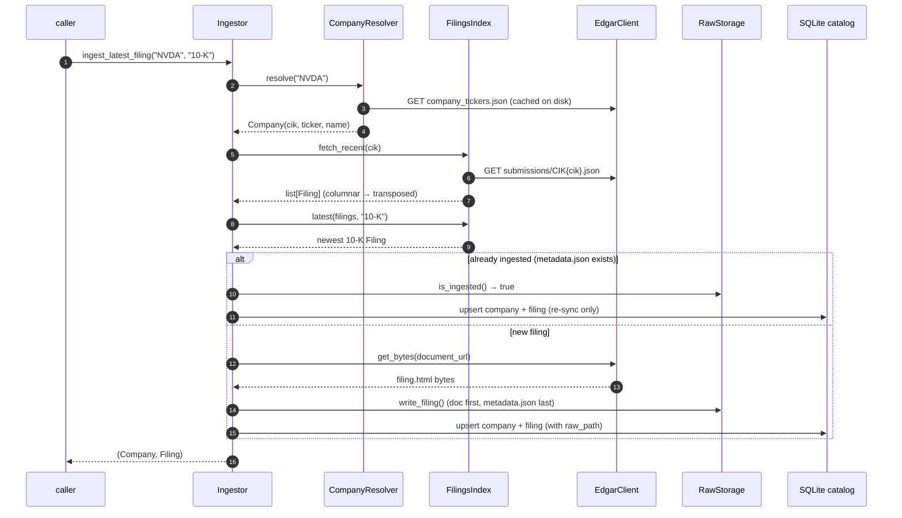

# Ingestion

**Status:** :material-check: Implemented · **Package:** `ingestion/`

Ingestion turns a ticker symbol into a downloaded 10-K plus catalog rows. It composes four
single-responsibility components behind one orchestrator, `Ingestor`.

## End-to-end sequence



## Components

### EdgarClient — `ingestion/edgar_client.py`

An async HTTP wrapper around `httpx.AsyncClient`, used as an async context manager so the
connection pool is always closed cleanly.

- **Required header.** Sends the SEC-mandated `User-Agent` (from
  `settings.edgar_user_agent`).
- **Client-side rate limiting.** An `asyncio.Semaphore(max_concurrent)` caps in-flight
  requests. Default is `settings.edgar_max_requests_per_second = 9`, staying under SEC's
  ~10 req/s ceiling. (Note: the knob currently bounds *concurrency*, not a strict
  requests-per-second rate.)
- **Retries.** `_request_with_retry` is wrapped with `tenacity`: up to 3 attempts on
  `httpx.RequestError` / `httpx.HTTPStatusError`, exponential backoff (1→10s),
  `reraise=True`.
- **API.** `get_json(url)` and `get_bytes(url)`.

### CompanyResolver — `ingestion/company_resolver.py`

Maps a ticker to a `Company` (CIK + name) using SEC's `company_tickers.json`.

- Fetches the file once and caches it at `data/raw/_meta/company_tickers.json`.
- **No TTL** — refresh by deleting the cache file. (A production system would add a TTL.)
- Ticker lookup is upper-cased; unknown tickers raise `KeyError`.
- CIKs are zero-padded to 10 digits by the `Company` DTO validator.

### FilingsIndex — `ingestion/filings_index.py`

Fetches a company's recent submissions from
`https://data.sec.gov/submissions/CIK{cik}.json`.

- EDGAR returns a **columnar** `recent` block (parallel arrays: `accessionNumber[]`,
  `form[]`, `filingDate[]`, `reportDate[]`, `primaryDocument[]`). `fetch_recent` transposes
  these into `list[Filing]`.
- `filter_by_form(filings, "10-K")` and `latest(filings, form_type)` select the target;
  `latest` picks `max(filing_date)` defensively rather than trusting EDGAR's ordering.

!!! info "Scope today"
    Only the `filings.recent` block is read. Older filings paginated into separate
    `filings.files[*]` JSON blobs are not yet followed — recent history only.

### RawStorage — `ingestion/storage.py`

Owns the immutable **Bronze** layer on disk:

```
data/raw/{ticker}/{accession_number}/
├── filing.html      # the primary document bytes
└── metadata.json    # provenance: company, filing, source_url, fetched_at, byte_count
```

- **Atomic-by-ordering write.** `write_filing` writes `filing.html` first and
  `metadata.json` last. A crash mid-write leaves no `metadata.json`, so the filing is
  correctly treated as incomplete and re-downloaded next run.
- **Idempotency marker.** `is_ingested()` returns `True` iff `metadata.json` exists.

### Ingestor — `ingestion/ingestor.py`

The orchestrator. `ingest_latest_filing(ticker, form_type="10-K", client=None)`:

1. Resolves the company, fetches filing history, selects the latest of `form_type`.
2. If already on disk, skips the download but **still** upserts company + filing so the
   catalog stays consistent.
3. Otherwise downloads via `Filing.document_url(cik)`, writes the raw layer, and upserts.

DB writes go through `_sync_to_db`, which uses `db.repository.upsert_company` /
`upsert_filing` inside a `get_session()` transaction. Note the orchestrator syncs
company + filing rows only — **parsing and chunk persistence are driven separately** (see
[Running It](../running.md)).

## Data contracts

`Company` and `Filing` (`ingestion/models.py`) are the typed boundary:

| Model | Key fields |
|-------|-----------|
| `Company` | `cik` (10-digit, zero-padded via validator), `ticker`, `name` |
| `Filing` | `accession_number`, `form_type`, `filing_date`, `report_date?`, `primary_document`, `primary_doc_description?` |

`Filing` also builds archive URLs: `document_url(cik)` →
`https://www.sec.gov/Archives/edgar/data/{cik_int}/{accession_no_dashes}/{primary_document}`.
