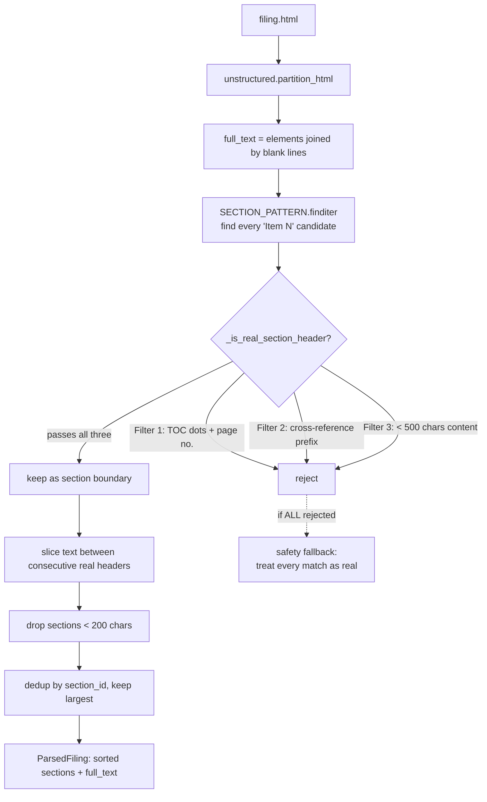

# Parsing

**Status:** :material-check: Implemented (Pass 2 disabled) · **File:** `parsing/parser.py`

`FilingParser.parse()` converts raw 10-K HTML into a `ParsedFiling` — a list of named
`ParsedSection`s plus the full extracted text. The principal challenge is not text
extraction but distinguishing a genuine section header from the many "Item N" strings that
also appear in the table of contents, cross-references, and exhibit indexes.

## Flow



## Two-pass design

```python title="parser.py — parse()"
# Pass 1: Item-N sections (narrative + cross-referenced sections)
sections = self._extract_sections(full_text)

# Pass 2: Financial-statement heading detection — folds under item_8
# financial_sections = self._extract_financial_statements(full_text, sections)
# if financial_sections:
#     sections = self._merge_financial_into_item_8(sections, financial_sections)
```

- **Pass 1 (active).** Regex-detects `Item N` headers, applies structural filters, slices
  the document between real headers.
- **Pass 2 (currently disabled).** Financial statements rarely sit under a literal
  "Item 8" heading in the HTML — they appear under their own titles like *CONSOLIDATED
  STATEMENTS OF OPERATIONS*. Pass 2 was designed to detect those (via
  `FINANCIAL_STATEMENT_PATTERN`) and fold them into a synthetic `item_8` so the financials
  are retrievable. **`_extract_financial_statements` is commented out**, so today the
  income statement / balance sheet may not be captured unless the filing happens to carry
  an explicit Item 8 narrative. Re-enabling this is on the [Roadmap](../roadmap.md).

## The three structural filters

`_is_real_section_header(match, text, all_matches)` returns `True` only if a candidate
survives all three checks:

| # | Filter | Rejects when | Rationale |
|---|--------|--------------|-----------|
| 1 | **TOC fingerprint** | `\.{3,}\s*\d+` after the match (dot leaders + page number), or 4+ spaces then a trailing number | Table-of-contents rows like `Item 1A. Risk Factors ....... 12` |
| 2 | **Cross-reference** | trigger word (`see`, `refer to`, `set forth in`, `incorporated … in`) immediately precedes the match | Inline pointers like `see Item 7A` |
| 3 | **Substantial content** | fewer than 500 chars before the next candidate | Bare pointers and index artifacts have no body |

If **every** candidate is rejected (an unusual filing layout), the parser falls back to
treating all raw matches as real rather than returning nothing. If there are no matches at
all, it returns a single `full_document` section.

After slicing, sections shorter than 200 chars are dropped, and duplicates of the same
`section_id` are collapsed by retaining the **largest** occurrence (the substantive body
rather than a stray reference). The result is sorted by character position.

## Output models — `parsing/models.py`

```python
class ParsedSection(BaseModel):
    section_id: str    # normalized, e.g. "item_1a"
    title: str         # "Item 1A. Risk Factors"
    text: str          # raw text content
    char_start: int    # offset in the full document
    char_end: int

class ParsedFiling(BaseModel):
    accession_number: str
    ticker: str
    sections: list[ParsedSection]
    full_text: str     # concatenated, for fallback
    char_count: int
```

`section_id` normalization is `item_{num}` in lower case (e.g. `Item 1A` → `item_1a`),
which is exactly the key the [chunker's taxonomy](chunking.md) looks up. `char_start` /
`char_end` are carried forward so every downstream chunk can cite its exact source span.

!!! note "Generalization"
    The filters are deliberately structural (dot-leaders, proximity, content length)
    rather than issuer-specific, so the parser has been verified to generalize from NVDA
    to AAPL (see `scripts/smoke_test_parse.py` and `scripts/diag_sections.py`).
