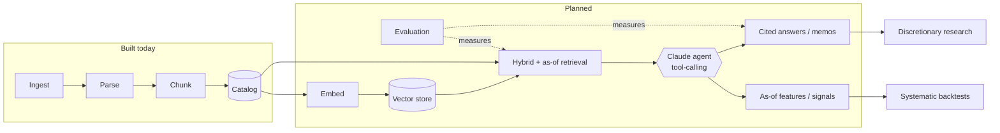

# Roadmap

Prioritized from the gaps in [Current State](current-state.md). Ordered so each stage
unblocks the next; nothing here is implemented yet.

## 1. Complete the embedding path

- Implement `VoyageProvider(EmbeddingProvider)` in `providers.py` using `voyageai` and
  `settings.embedding_model` (`voyage-finance-2`), honoring the `document`/`query`
  `input_type`.
- Implement the `Embedder` orchestrator (`embedder.py`): chunks → `BatchItem`s →
  `validate_items` → `batch_items` → `provider.embed` → persist vectors. Add async retry /
  rate limiting around provider calls.
- Integrate the **Chroma** vector store (`settings.chroma_dir`): write vectors keyed by
  `accession#chunk_index` with `section_label` / `priority` / char-span metadata for
  filtering and citation.

## 2. Real tokenization

Replace the `len(text) // 4` proxy with the provider's tokenizer so
`BatchLimits.max_tokens_per_batch` / `max_tokens_per_item` are enforced against true token
counts. Store the real `token_count` on chunks.

## 3. Retrieval (`retrieval/`)

Hybrid search over the embedded corpus:

- Dense similarity (Chroma) + sparse **BM25** (`rank-bm25`), fused.
- **Section-label pre-filtering** (e.g. restrict to `risk_factors`) and
  **priority-weighted** ranking using the `priority` already stored per chunk.
- Return chunks with full provenance so answers can cite `accession` + section + char span.

## 4. Point-in-time / temporal correctness

Use the temporal columns the schema already carries (`filing_date`, `report_date`,
`ingested_at`):

- `get_filings_as_of(ticker, date)` and as-of retrieval that excludes filings not yet
  public at a given date (no look-ahead).
- Amendment (`10-K/A`) linkage and supersession so the "current" view resolves correctly.
- Filing-to-filing diffing (e.g. year-over-year Risk-Factor changes).

## 5. Generation (`generation/`)

Claude-based (the `anthropic` dependency is already present) grounded generation:
cited answers and drafted memos built strictly from retrieved chunks, with the section
provenance surfaced inline.

## 6. Evaluation (`evaluation/`)

Retrieval metrics (recall / MRR / nDCG on a labeled query set) and answer-quality checks
(citation validity, faithfulness) to make changes measurable rather than anecdotal.

## 7. API + orchestration (`api/`)

A single orchestrated `ingest → parse → chunk → embed → persist` entrypoint and a CLI,
then a **FastAPI** surface (`fastapi`/`uvicorn` are present) exposing ingest, retrieve, and
ask endpoints.

## 8. Engineering cleanups

- Remove the duplicate `db/ingestor.py`.
- Adopt **Alembic** migrations instead of `create_all`.
- Re-enable and validate parser **Pass 2** (financial-statement folding into `item_8`).
- Follow paginated older submissions (`filings.files[*]`), not just `recent`.
- Add a `pytest` suite alongside the smoke-test scripts.

## Target architecture (planned)

The direction the items above lead toward: a temporally aware, citation-grounded retrieval
substrate that a human analyst and an automated agent query in the same way. **This is a
design target, not current behavior.**

The catalog + vector store become a point-in-time knowledge base; retrieval tools
(`get_filings_as_of`, `retrieve(..., as_of)`, `compare_filings`) let a Claude orchestrator
produce cited memos for discretionary work and no-look-ahead features for systematic work
from the **same** substrate.
