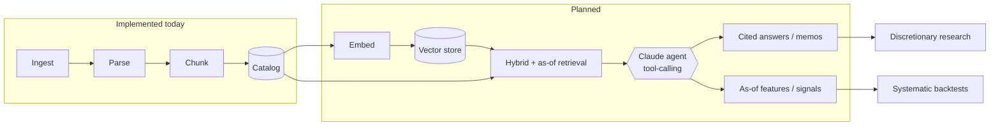

# Vision

This page describes the product direction and the rationale behind the architecture. It is
forward-looking: it explains what the system is intended to become and why. For an accurate
account of what is implemented today, see [Current State](current-state.md); for the
sequenced plan, see the [Roadmap](roadmap.md).

## Problem

Fundamental research depends on primary-source disclosures such as SEC filings, yet the
available tooling tends to fall into two categories:

- **Data terminals** (Bloomberg, FactSet, S&P Capital IQ): authoritative but closed, costly,
  and not designed to be composed into programmatic or agent-driven workflows.
- **General-purpose LLM assistants and generic RAG**: fast but weakly grounded — prone to
  unsupported claims, limited citation, generic embeddings that handle financial language
  poorly, and, most importantly, no concept of point-in-time correctness.

The final point is the central gap. In systematic research, look-ahead bias invalidates
results: a model that reads a filing before its publication date produces misleading
backtests, and few LLM-based tools guarantee temporal integrity. In discretionary research,
analysts still compare disclosures across reporting periods by hand.

## Intended system

A temporally correct, citation-grounded retrieval layer over primary financial disclosures
that a human analyst and an automated process can query through the same interface, with
agent-based tool-calling built on top.

The foundation for this — ingestion, parsing, section-aware chunking with provenance, and a
metadata catalog — is implemented today. The retrieval, generation, evaluation, and agent
layers are planned; see the [Roadmap](roadmap.md).

## Architectural rationale

- **Primary-source grounding with provenance.** Every chunk carries its accession number,
  section, and character span, so downstream answers can be cited and audited.
- **Domain-aware, priority-weighted retrieval.** The section taxonomy concentrates retrieval
  on the disclosures most relevant to investment decisions (Risk Factors, MD&A) rather than
  applying uniform fixed-size chunking.
- **Reproducible, immutable data layers.** Identical source inputs yield identical downstream
  artifacts, a prerequisite for reliable backtesting.
- **Typed contracts and clear boundaries.** Protocol-based providers, validated batching, and
  separated DTO and ORM layers keep the system testable and vendor-independent.
- **Temporal fields captured at ingest.** `filing_date`, `report_date`, and `ingested_at` are
  recorded and indexed, providing the basis for as-of retrieval that avoids look-ahead bias.
  The query logic that consumes them is planned, not yet implemented.

## Target workflow

The catalog and vector store are intended to function as a point-in-time knowledge base. An
orchestrating agent — using the Anthropic Claude SDK, already a project dependency — would
call typed tools such as `get_filings_as_of(ticker, date)`,
`retrieve(query, section_filter, as_of)`, and `compare_filings(t1, t2)`, delegating to
specialized sub-agents (risk, financials, MD&A) whose findings are synthesized with
citations.

A single substrate is intended to serve two use cases:

- **Discretionary research.** Analysts query in natural language, receive cited answers, and
  generate period-over-period comparisons and draft memoranda.
- **Systematic research.** The same point-in-time retrieval and extraction produce as-of
  features — for example, changes in risk-factor language or management discussion — that can
  be incorporated into quantitative models without look-ahead bias.

The objective is a single temporally correct, auditable substrate that serves both the
analyst and the automated strategy, rather than a conversational assistant layered over
ungrounded data.
